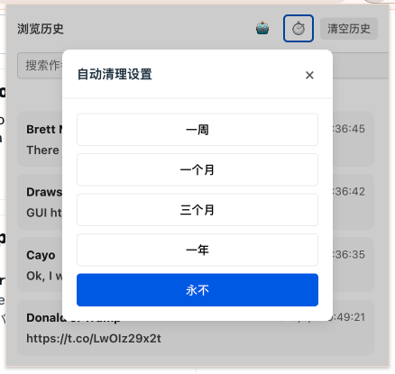

# 🌟 X Copilot

An elegant browser extension that helps you record and manage your X (Twitter) browsing history. Access quickly through keyboard shortcuts, with intelligent search support, making your browsing experience smoother. Your personal X assistant.

<div align="center">
    <a href="./README.zh-CN.md">
        中文版本
    </a>
    |
    <a href="./README.en-US.md">
        English Version
    </a>
</div>

## 🚀 Features

- [x] 🔥 Record Browsing History
- [x] 🎯 Timing Clean History Record
- [x] 🔍 Real-time History Search
- [ ] 💫 Elegant Animations
- [x] 🌈 Modern UI Design
- [ ] 📱 Responsive Layout
- [x] 🔥 Quick Access (Shift+K)
- [x] 🔍 Intelligent Search
  - [x] Google
  - [ ] Anthropic
  - [x] OpenAI
  - [ ] Grok
- [ ] 📄 Export History
- [ ] 🔄 Auto-Migrate Versions History(Coming Soon💫)

## 💡 Key Features

1. **Smart History Recording**

   - Automatically records tweets you're interested in
   - Dwell time-based recording
   - Prevents cluttering with unwanted records

2. **Quick Access**

   - Global shortcut (⌘K / Ctrl+K)
   - Beautiful popup animation
   - Blur background effect

3. **Intelligent Search**

   - Real-time filtering
   - Search by author or content
   - Case-insensitive matching

4. **Modern Interface**
   - Clean and minimal design
   - Smooth animations
   - Responsive layout
   - Custom scrollbar styling

## Some screenshots

### browser history


### clean history



### record flow
<div>
there is a demo 
    <a href="./public/screenshots/video.mp4">
        video
    </a>
</div>


## How to use

download the latest release from [here](https://github.com/Tzyito/x-copilot/releases)

## 📦 Development Setup

```bash
# Install dependencies
pnpm install


# Development mode
pnpm dev

# Build extension
pnpm build
```

## 🤝 Contributing

Contributions are welcome! Feel free to submit a Pull Request or create an Issue.

## 📄 License

[MIT](./LICENSE) License © [tzyito](https://github.com/tzyito)
